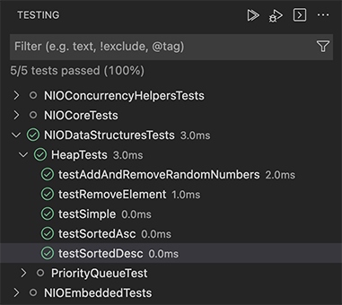

# Swift for Visual Studio Code

This extension adds language support for Swift to Visual Studio Code. It supports:

* Code completion
* Jump to definition, peek definition, find all references, symbol search
* Error annotations and apply suggestions from errors
* Automatic generation of launch configurations for debugging with [CodeLLDB](https://marketplace.visualstudio.com/items?itemName=vadimcn.vscode-lldb)
* Automatic task creation
* Package dependency view
* Test Explorer view

Swift support uses [SourceKit LSP](https://github.com/apple/sourcekit-lsp) for the [language server](https://microsoft.github.io/language-server-protocol/overviews/lsp/overview/) to power code completion and [LLDB](https://github.com/vadimcn/vscode-lldb) to enable debugging.

The extension is developed by members of the Swift Community and maintained by the [SSWG](https://www.swift.org/sswg/). The aim is to provide a first-class, feature complete extension to make developing Swift applications on all platforms a seamless experience.

If you experience any issues or want to propose new features please [create an issue](https://github.com/swift-server/vscode-swift/issues/new) or post on the `#vscode-swift` channel on [Slack](https://swift-server.slack.com).

## Contributing

The Swift for Visual Studio Code extension is a community driven project, developed by the amazing Swift community. Any kind of contribution is appreciated, including code, tests and documentation. For more details see [CONTRIBUTING.md](CONTRIBUTING.md).

## Installation

For the extension to work, you must have Swift installed on your system. Please see the [Getting Started Guide on Swift.org](https://www.swift.org/getting-started/) for details on how to install Swift on your system. Install the extension from [VS Code Marketplace](https://marketplace.visualstudio.com/items?itemName=sswg.swift-lang) and open a Swift package! You'll be prompted to install and configure the CodeLLDB extension, which you should do so.

## Features

### Language features

The extension provides language features such as code completion and jump to definition via the Apple project [SourceKit-LSP](https://github.com/apple/sourcekit-lsp). For these to work fully it is required that the project has been built at least once. Every time you add a new dependency to your project you should build it so SourceKit-LSP can extract the symbol data for that dependency.

### Automatic task creation

For workspaces that contain a **Package.swift** file, this extension will create the following tasks:

- **Build All**: Build all targets in the Package
- **Build Debug <Executable>**: Each executable in a Package.swift get a task for building a debug build
- **Build Release <Executable>**: Each executable in a Package.swift get a task for building a release build

These tasks are available via **Terminal ▸ Run Task...** and **Terminal ▸ Run Build Task...**.

### Commands

The extension adds commands, available via the command palette.

- **Resolve Package Dependencies**: Run `swift package resolve` on package associated with open file.
- **Update Package Dependencies**: Run `swift package update` on package associated with open file.
- **Reset Package Dependencies**: Run `swift package reset` on package associated with open file.
- **Open Package.swift**: Open Package.swift for package associated with open file.
- **Clean Build**: Run `swift package clean` on package associated with open file.
- **Run Swift Script**: Run the currently open file, as a Swift script. If the file has not been saved it will save it to a temporary file so it can be run.
- **Run Swift Snippet**: If the currently open file is a Swift snippet then run it.
- **Debug Swift Snippet**: If the currently open file is a Swift snippet then debug it.
- **Run Command Plugin**: Display menu of command plugins for currently loaded packages.

The following command is only available on macOS
- **Select Xcode Developer Dir**: Select the version of Xcode you want to use swift tools from.
- **Select Target Platform**: This is an experimental command used to get code completion for iOS, tvOS projects

### Package dependencies

If your workspace contains a package that has dependencies, this extension will add a **Package Dependencies** view to the Explorer:

Additionally, the extension will monitor **Package.swift** and **Package.resolved** for changes, resolve any changes to the dependencies, and update the view as needed.

### Debugging

The Swift extension uses the [CodeLLDB](https://marketplace.visualstudio.com/items?itemName=vadimcn.vscode-lldb) extension for debugging.

When you open a Swift package (a directory containing a **Package.swift**) the extension creates build tasks and launch configurations for each executable. If the package contains tests, the extension creates a configuration to run the tests. These all use the CodeLLDB extension as a debugger.

Press `F5` to run an executable and start debugging. If you have multiple launch configurations you can choose which launch configuration to use in the debugger view.

CodeLLDB has a version of `lldb` packaged with it and by default this is the version it uses for debugging. However, this version of `lldb` does not work with Swift. Fortunately, CodeLLDB allows you to choose an alternate version. The Swift extension will attempt to ascertain which version is required and give you the option to update the CodeLLDB configuration.

### Test Explorer

If your package contains tests then they can be viewed, run and debugged in the Test Explorer.

Once your project has been built the Test Explorer will be able to list all your tests. These are grouped by package, then test target and finally XCTestCase class. From the Test Explorer you can initiate a test run, debug a test run and if a file has already been opened you can jump to the source for a test.

### Documentation

* [Extension Settings](docs/settings.md)
* [Test Coverage](docs/test-coverage.md)
* [Visual Studio Code Dev Containers](docs/remote-dev.md)
