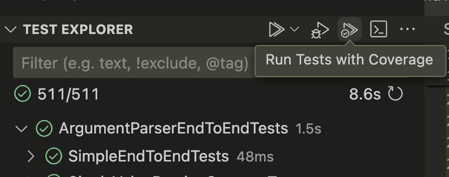

# Test Coverage

Test coverage is a measurement of how much of your code is tested by your tests. It defines how many lines of code were actually run when you ran your tests and how many were not. When a line of code is not run by your tests it will not have been tested and perhaps you need to extend your tests.

The Swift extension integrates with VSCode's Code Coverage APIs to record what code has been hit or missed by your tests.

Once you've performed a code coverage run a coverage report will be displayed in a section of the primary side bar. This report lists all the source files in your project and what percentage of lines were hit by tests. You can click on each file to open that file in the code editor. If you close the report you can always get it back by running the command `Test: Open Coverage`.

After generating code coverage lines numbers in covered files will be coloured red or green depending on if they ran during the test run. Hovering over the line numbers shows how many times each line was run. Hitting the "Toggle Inline Coverage" link that appears when hovering over the line numbers will keep this information visible.

